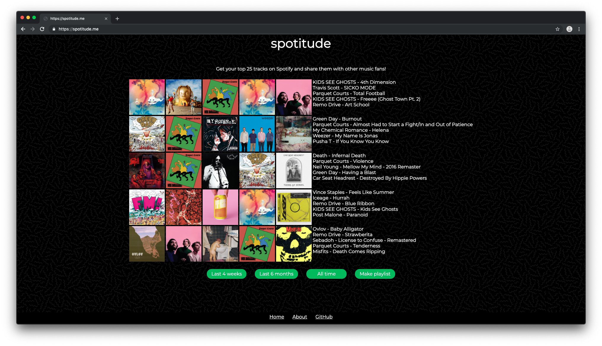

# Spotitude

Music is social. From sharing cassettes, burning CDs to sharing mp3s via peer-to-peer, we like sharing music with others.

Spotitude is a simple web app which shows your top 25 tracks so you can share what you've been listening to with other music fans. The code runs on the client side so no data is saved to another server. It's also open source so you can know what's going on behind the scenes.

## Why (yet) another music visualizer?

Spotitude is a passion project born after discovering that Spotify doesn't provide any analytics to its users. Many people such as myself pay for premium, yet there is no feature to show my current listening habits. Not only that, Spotify's social factor is practically non-existent. I can follow my friends but I can't see their listening habits, so what's the point?

There are other music aggregators that exist on the internet but I was unsatisfied with them for a few reasons:

* The user is only presented with a list of plain text
* The source code is not shared to the user
* There is no way to share these tracks to others

Spotitude was made to address these issues.

## Features

Spotitude simply presents the user with their top 25 tracks based on 3 time periods which Spotify provides through their API:

* `short term`: Last 4 weeks
* `medium term`: Last 6 months
* `long term`: All time

You can save the songs displayed to you to a Spotify playlist which you can then share to others.

---

Spotitude is made with [Vue.js](https://vuejs.org/). I also created a [Python version](https://github.com/dtcrout/spotitude) of the visualization which was the POC for this project.
